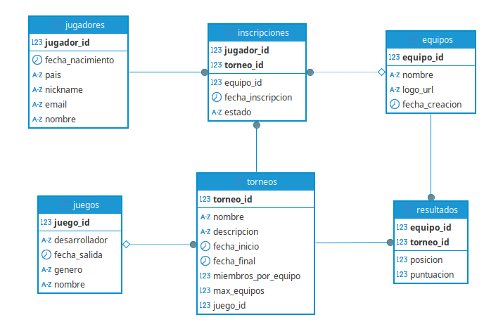

# 🎮 eSports Arena Manager - API REST

Sistema backend para la gestión profesional de torneos de eSports donde los equipos compiten en torneos de diferentes videojuegos. El sistema registra inscripciones de jugadores, forma equipos y gestiona los resultados de cada competición.

---

## 📋 Tabla de Contenidos

- [Características Principales](#-características-principales)
- [Modelo de Datos](#-modelo-de-datos)
- [Tecnologías Utilizadas](#️-tecnologías-utilizadas)
- [Requisitos Previos](#-requisitos-previos)
- [Instalación y Ejecución](#-instalación-y-ejecución)
- [Endpoints de la API](#-endpoints-de-la-api)
- [Reglas de Negocio](#-reglas-de-negocio)
- [Documentación Interactiva](#-documentación-interactiva)
- [Autor](#-autor)

---

## ✨ Características Principales

- **Gestión completa de torneos de videojuegos** con control de inscripciones y resultados
- **Sistema de equipos flexible** que soporta torneos individuales (1v1) y por equipos (hasta 10 jugadores)
- **Paginación** en todos los listados para manejar grandes volúmenes de datos
- **Búsqueda avanzada** de juegos por desarrollador y género con filtros combinables
- **Validaciones de negocio robustas** con manejo centralizado de excepciones
- **Cálculo automático de posiciones** en el ranking basado en puntuación
- **API REST documentada** con Swagger/OpenAPI
- **Panel de administración web** incluido para gestión visual

---

## 📊 Modelo de Datos

El sistema cuenta con **6 entidades principales** que modelan el dominio de torneos de eSports:



### Entidades

| Entidad | Descripción |
|---------|-------------|
| **Jugador** | Representa a los competidores con información personal (nickname único, email único, país, fecha de nacimiento) |
| **Equipo** | Agrupación de jugadores para competir en torneos. Puede ser individual (auto-generado) o multi-jugador |
| **Torneo** | Evento competitivo asociado a un videojuego específico con configuración de equipos y cupos |
| **Juego** | Videojuego sobre el que se organiza el torneo (ej: League of Legends, Valorant, FIFA) |
| **Inscripcion** | Relación N:M entre Jugador y Torneo, con estado (CONFIRMADA, ELIMINADA, FINALIZADA) |
| **Resultado** | Relación N:M entre Equipo y Torneo, almacena posición y puntuación final |

### Relaciones Clave

- **Juego → Torneo** (1:N): Un juego puede tener múltiples torneos
- **Jugador → Inscripcion** (1:N): Un jugador puede inscribirse en múltiples torneos
- **Torneo → Inscripcion** (1:N): Un torneo tiene múltiples inscripciones
- **Equipo → Inscripcion** (1:N): Los jugadores se inscriben asociados a un equipo
- **Equipo → Resultado** (1:N): Un equipo puede competir en múltiples torneos
- **Torneo → Resultado** (1:N): Un torneo tiene resultados de múltiples equipos

---

## 🛠️ Tecnologías Utilizadas

### Backend
- **Java 21**
- **Spring Boot 4.0.1**
  - Spring Data JPA (Hibernate)
  - Spring Web (REST)
  - Spring Validation
- **MySQL 8.0**
- **Maven** - Gestión de dependencias

### Librerías
- **Lombok** - Reducción de código boilerplate
- **MapStruct 1.6.3** - Mapeo automático entre entidades y DTOs
- **SpringDoc OpenAPI 3.0.0** - Documentación Swagger automática

### Frontend (Panel de Administración)
- HTML5 + CSS3 + JavaScript (Vanilla)
- Interfaz responsive con diseño moderno

---

## 📦 Requisitos Previos

- **JDK 21** o superior
- **MySQL 8.0** o superior
- **Maven 3.8+**
- **Git** (para clonar el repositorio)

---

## 🚀 Instalación y Ejecución

### 1️⃣ Clonar el repositorio

```bash
git clone https://github.com/tuusuario/torneo-videojuegos-api.git
cd torneo-videojuegos-api
```

### 2️⃣ Configurar la base de datos

Crear la base de datos en MySQL:

```sql
CREATE DATABASE torneo CHARACTER SET utf8mb4 COLLATE utf8mb4_unicode_ci;
```

Editar `src/main/resources/application.properties` si es necesario:

```properties
spring.datasource.url=jdbc:mysql://localhost:3306/torneo
spring.datasource.username=root
spring.datasource.password=tu_contraseña
```

### 3️⃣ Compilar y ejecutar

```bash
# Compilar el proyecto
mvn clean install

# Ejecutar la aplicación
mvn spring-boot:run
```

La aplicación estará disponible en: **http://localhost:8080**

### 4️⃣ Acceder a la documentación

- **Swagger UI**: http://localhost:8080/swagger-ui.html
- **Panel Web**: http://localhost:8080/index.html

---

## 🔌 Endpoints de la API

### 🎯 Juegos

| Método | Endpoint | Descripción |
|--------|----------|-------------|
| GET | `/api/juegos?page=0&size=10` | Listar juegos con paginación |
| GET | `/api/juegos/buscar?desarrollador={dev}&genero={gen}` | **Búsqueda avanzada** por desarrollador y/o género |
| GET | `/api/juegos/{id}` | Obtener juego por ID |
| POST | `/api/juegos` | Crear nuevo juego |
| PUT | `/api/juegos/{id}` | Actualizar juego |
| DELETE | `/api/juegos/{id}` | Eliminar juego |

### 🏆 Torneos

| Método | Endpoint | Descripción |
|--------|----------|-------------|
| GET | `/api/torneos?page=0&size=10` | Listar torneos con paginación |
| GET | `/api/torneos/{id}` | Obtener torneo por ID |
| POST | `/api/torneos` | Crear nuevo torneo |
| PUT | `/api/torneos/{id}` | Actualizar torneo |
| DELETE | `/api/torneos/{id}` | Eliminar torneo |

### 🎮 Jugadores

| Método | Endpoint | Descripción |
|--------|----------|-------------|
| GET | `/api/jugadores?page=0&size=10` | Listar jugadores con paginación |
| GET | `/api/jugadores/{id}` | Obtener jugador por ID |
| POST | `/api/jugadores` | Registrar nuevo jugador |
| PUT | `/api/jugadores/{id}` | Actualizar jugador |
| DELETE | `/api/jugadores/{id}` | Eliminar jugador |

### 👥 Equipos

| Método | Endpoint | Descripción |
|--------|----------|-------------|
| GET | `/api/equipos?page=0&size=10` | Listar equipos con paginación |
| GET | `/api/equipos/{id}` | Obtener equipo con lista de miembros |
| POST | `/api/equipos` | Crear nuevo equipo |
| PUT | `/api/equipos/{id}` | Actualizar equipo |
| DELETE | `/api/equipos/{id}` | Eliminar equipo |

### 📝 Inscripciones

| Método | Endpoint | Descripción |
|--------|----------|-------------|
| POST | `/api/inscripciones` | Inscribir jugador en torneo |
| GET | `/api/inscripciones/torneo/{torneoId}` | Listar inscripciones de un torneo |
| PATCH | `/api/inscripciones/{jugadorId}/{torneoId}/estado?estado=CONFIRMADA` | Cambiar estado de inscripción |
| DELETE | `/api/inscripciones/{jugadorId}/{torneoId}` | Eliminar inscripción |

### 🏅 Resultados

| Método | Endpoint | Descripción |
|--------|----------|-------------|
| POST | `/api/resultados` | Registrar resultado de equipo |
| PUT | `/api/resultados/{equipoId}/{torneoId}` | Actualizar puntuación |
| GET | `/api/resultados/torneo/{torneoId}/ranking` | Obtener ranking ordenado por puntuación |
| DELETE | `/api/resultados/{equipoId}/{torneoId}` | Eliminar resultado |

---

## 📜 Reglas de Negocio

El sistema implementa las siguientes validaciones de negocio en la capa de servicio:

| ID | Regla | Código HTTP | Mensaje |
|----|-------|-------------|---------|
| **RN-01** | Email y nickname únicos | 409 Conflict | "El email/nickname ya está registrado" |
| **RN-02** | Validación de miembros en equipo | 400 Bad Request | "El equipo ya tiene el máximo de X miembros activos" |
| **RN-03** | Control de cupos del torneo | 400 Bad Request | "El torneo ha alcanzado su capacidad máxima de equipos" |
| **RN-04** | No duplicar inscripciones | 409 Conflict | "El jugador ya está inscrito en este torneo" |
| **RN-05** | Coherencia de fechas | 400 Bad Request | "La fecha de inicio debe ser anterior a la fecha final" |
| **RN-06** | Estados de inscripción válidos | - | Solo permite: CONFIRMADA, ELIMINADA, FINALIZADA |
| **RN-07** | Equipo inscrito antes de registrar resultado | 400 Bad Request | "El equipo no está inscrito en este torneo" |

Todas las excepciones son capturadas por `GlobalExceptionHandler` y devueltas como JSON limpio con el código HTTP apropiado.

---

## 📖 Documentación Interactiva

La API incluye **Swagger UI** para probar los endpoints de forma interactiva:

1. Iniciar la aplicación
2. Abrir en el navegador: http://localhost:8080/swagger-ui.html
3. Explorar y probar los endpoints directamente desde la interfaz

**Características de Swagger:**
- Listado completo de endpoints organizados por etiquetas
- Modelos de request/response con validaciones
- Prueba en vivo de cada endpoint
- Generación automática de código cliente

---

## 👨‍💻 Autor

**Roberto**  
2º Desarrollo de Aplicaciones Multiplataforma (DAM)  
IES Juan Bosco

---

## 📄 Licencia

Este proyecto fue desarrollado como Proyecto Final del módulo de Acceso a Datos (2024-2025).

---

## 🔧 Características Técnicas Destacables

- **Arquitectura en capas** (Controller → Service → Repository)
- **DTOs** para desacoplar la API de la base de datos
- **MapStruct** para mapeo eficiente y type-safe
- **Paginación nativa** con `Pageable` y `Page<T>`
- **Consultas JPQL** personalizadas con filtros opcionales
- **Manejo centralizado de excepciones** con respuestas JSON limpias
- **Validación declarativa** con Jakarta Validation (`@Valid`, `@NotNull`, etc.)
- **Transaccionalidad** con `@Transactional` en operaciones de escritura
- **Carga condicional de datos** con `DatabaseInitConfig` (solo si la BD está vacía)
- **Cálculo automático de rankings** mediante recalculación de posiciones
